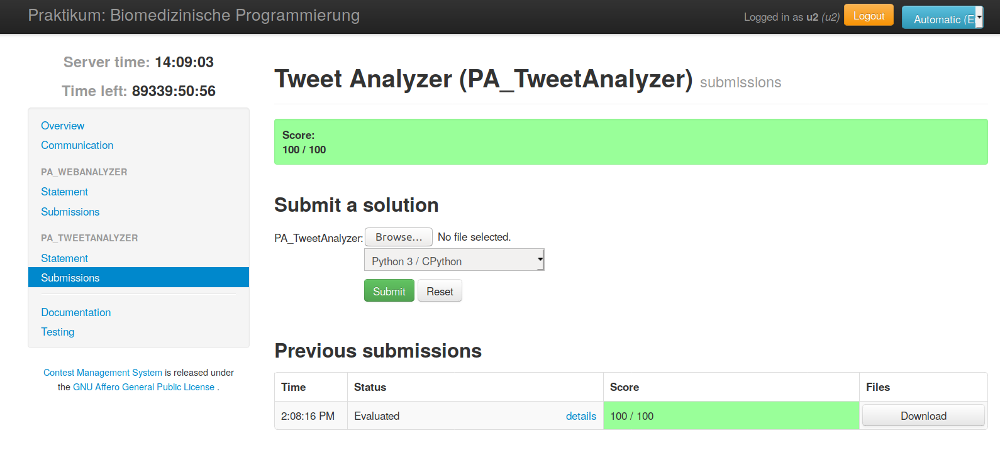
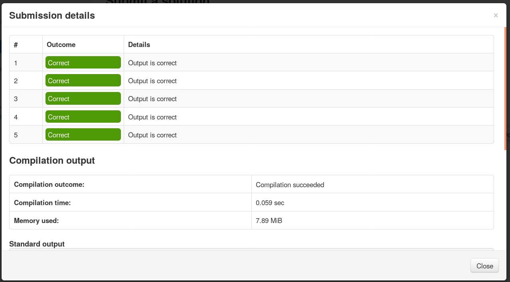

# MISITcms - Assignment/Contest Management System

This project aims at providing a fast setup of an Contest Management System. We are focusing on the teaching use case based on automatic code evaluation of assignments from students.

We wrapped the Contest Management System [CMS](https://github.com/cms-dev/cms) in a docker-compose setup, continued contribution and further development of new features.

## How to Use

- The setup was tested on Ubuntu 18.04 with Docker 19.03.6.
- Docker-compose was manually installed. (version 1.25.4)

#### Setup MISITcms

- Install docker and docker-compose on your Ubuntu 18.04 workstation.
```sh
apt-get install -y docker.io docker-compose git
usermod -aG docker $USER
systemctl enable docker && systemctl start docker
curl -L https://github.com/docker/compose/releases/download/1.25.4/docker-compose-`uname -s`-`uname -m` -o /usr/bin/docker-compose
chmod +x /usr/bin/docker-compose
```

- Clone this repository and enter the directory.
```sh
git clone https://github.com/frankkramer-lab/MISITcms-app.git
cd MISITcms-app/
```

- Add your certificate to `./nginx/*.key\crt` or self-generate SSL certificates using `./generateCerts.sh`.

- Modify your CMS config in `./cms-config/*.conf`.

- Put your tasks into `./cms-course/`.

- Start the docker-compose instance.
`docker-compose up --build`

- Enter in your web browser:
  - `https://$HOST/` for contest login
  - `https://$HOST/admin` for admin login

Admin username and password are stored in `./cms-config/cms.conf` under the variables:  
"admin_user" and "admin_password".  (Default: user=admin; pw=misit-cms)

#### Remarks
When modifying the `./cms-app/config/cms.conf`, make sure to keep the access credentials/database name to the PostgreSQL database. If you need to change the credentials/database name, please adapt them in `./docker-compose.yml` and `./postgres/initdb.sql` accordingly.

The logs are accessible at `./cms-logs/` after the docker-compose instance was launched.

## File Structure

MISITcms utilizes 3 mounted directories:
- **cms-config:** Contains the two configuration files for CMS.
- **cms-course:** Contains all the data for the contest and tasks.
- **cms-logs:** Contains the log files for all running CMS services.

The mounted directories allow fast and interactive access to the important CMS files. This eliminates the need to access the inner part of the docker containers, if you want to change the course data or have a look on the logs.

We provided several examples in cms-course, which are demonstrating how tasks can/should be defined.

Content of cms-course:
- **data/ :** Contains data sets which will be mounted into sandboxes.
- **example_task/ :** Contains a task (with task.yaml, input/, output/, sol/ and statement/).
- **contest.yaml:** Contest configuration file.
- **requirements.txt:** (optional) List of Python packages for automatic installation inside sandboxes.

Updates in cms-course or cms-config will be automatically detected and executed after a docker container restart.

## CMS

**Website:** http://cms-dev.github.io/  
**Git repository:** https://github.com/cms-dev/cms  
**Wiki:** https://cms.readthedocs.io/en/latest/  

CMS is a software for organizing programming contests similar to well-known international contests like the IOI (International Olympiad in Informatics). It was written by and it received contributions from people involved in the organization of similar contests on a local, national and international level, and it is regularly used for such contests in many different countries. It is meant to be secure, extendable, adaptable to different situations and easy to use.

CMS is a complete, tested and well proved solution for managing a contest. However, it only provides limited tools for the development of the task data belonging to the contest (task statements, solutions, testcases, etc.). Also, the configuration of machines and network resources that host the contest is a responsibility of the contest administrators.

#### CMS Structure

CMS is composed of several services, that can be run on a single or on many servers. The core services are:

- **LogService:**  collects all log messages in a single place
- **ResourceService:** collects data about the services running on the same server, and takes care of starting all of them with a single command
- **Checker:** simple heartbeat monitor for all services
- **EvaluationService:** organizes the queue of the submissions to compile or evaluate on the testcases, and dispatches these jobs to the workers
- **Worker:** actually runs the jobs in a sandboxed environment
- **ScoringService:** collects the outcomes of the submissions and computes the score
- **ContestWebServer:** the webserver that the contestants will be interacting with
- **AdminWebServer:** the webserver to control and modify the parameters of the contests

## Further contributions and development of CMS

**Docker Support:**  
- Fixed some CMS bugs in order to be workable inside a docker container
- Added a bugfix for isolate for working recursive mounts
- Complete integration into a docker-compose setup
- Automatic synchronization of important files into and from the docker container

**Continued development for Python 3.X support:**  
- Switch to UTF-8 encoding as standard for Python
- Improved module support (NumPy, pandas, scikit-learn, ...)
- Automatic installation of required Python packages for assignments

**Added CMS Features:**  
- Added option for uploading multiple scripts in a single task
- Changed default input of tasks from STDIN to ARGS
- Added mountable data directory into Sandbox environments for large and multiple file access in tasks
- "enable_networking" option in config file to allow network/internet connections inside the isolate container if required
- "allow_writing_in_home" option in config file to allow writable home directory inside the isolate container if required
- "enable_output_stdout/err" option in config file to allow users viewing the stderr or/and stdout of their submissions if required
- Configurable number of initialized workers in config file

## Screenshots





## Authors

**Johann Frei**  
Email: johann.frei@informatik.uni-augsburg.de  
IT-Infrastructure for Translational Medical Research  
University Augsburg  
Augsburg, Bavaria, Germany

**Dominik Müller**  
Email: dominik.mueller@informatik.uni-augsburg.de  
IT-Infrastructure for Translational Medical Research  
University Augsburg  
Augsburg, Bavaria, Germany
